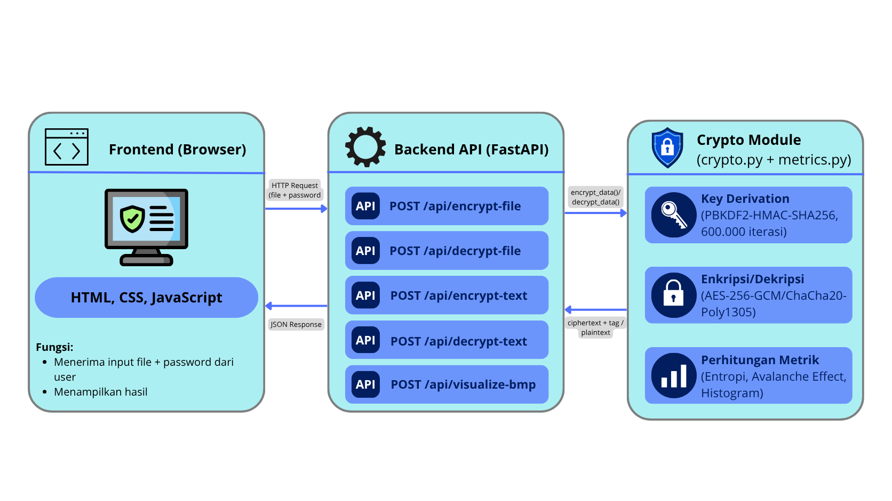
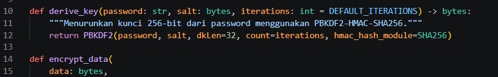
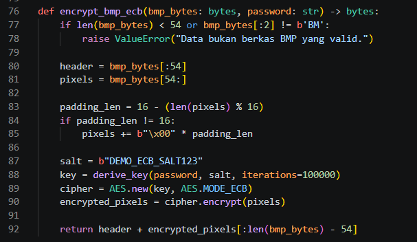
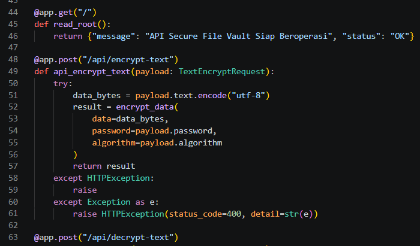

# Secure File Vault & Citra Visualizer (ECB vs GCM)
## Laporan Teknis Tugas Proyek Aplikasi Kriptografi

**Topik:** A — Aplikasi Enkripsi (Algoritma Modern)
**Mata Kuliah:** Keamanan Informasi
**Anggota:**
1. Aisyah Nitiarahma (247006111073)
2. Agniya Azzahra (247006111090)
3. Diyani Rahayu Nur'aeni (247006111115)

======================================================================================================================================================================================================

## BAB I — PENDAHULUAN

### 1.1. Latar Belakang

Perlindungan data pribadi dan berkas sensitif menjadi kebutuhan mendasar di era digital, terutama untuk dokumen identitas, laporan keuangan, atau data medis yang rentan terhadap akses tidak sah dan manipulasi jika tidak dienkripsi dengan tepat. Salah satu kesalahan umum dalam kriptografi adalah penggunaan mode operasi cipher blok yang tidak aman seperti Electronic Code Book (ECB), yang membuat pola pada plainteks tetap "membayang" pada cipherteks karena blok identik selalu menghasilkan hasil enkripsi identik (Dworkin, 2007; Stallings, 2017).

Berdasarkan hal tersebut, proyek ini mengembangkan Secure File Vault, aplikasi web untuk mengenkripsi dan mendekripsi berkas menggunakan AES-256-GCM — mode authenticated encryption yang menjamin kerahasiaan sekaligus integritas data (Dworkin, 2007), sejalan dengan penelitian Hernandi dan Chandra (2024) dan Zulian dkk. (2025). Kunci diturunkan dari kata sandi menggunakan PBKDF2 dengan 600.000 iterasi (Moriarty dkk., 2017; Sönmez Turan dkk., 2010) untuk memperkuat ketahanan terhadap brute-force. Sebagai pembanding edukatif, aplikasi juga memvisualisasikan perbedaan mode ECB dan GCM pada citra digital.

### 1.2. Masalah

1. Bagaimana mengimplementasikan enkripsi berkas yang aman menggunakan AES-256-GCM dengan kunci berbasis kata sandi (PBKDF2)?
2. Bagaimana aplikasi menjamin integritas data dengan menolak dekripsi saat kata sandi salah atau cipherteks dimodifikasi?
3. Seberapa baik kinerja algoritma dilihat dari waktu eksekusi, avalanche effect, dan entropi cipherteks?
4. Bagaimana perbedaan keamanan mode ECB dan GCM dapat divisualisasikan secara nyata?

### 1.3. Tujuan Aplikasi

1. Mengimplementasikan aplikasi enkripsi/dekripsi berkas menggunakan AES-256-GCM dengan kunci turunan PBKDF2.
2. Menerapkan authenticated encryption yang menolak dekripsi saat kata sandi salah atau cipherteks dimanipulasi.
3. Menguji aplikasi secara kuantitatif: kebenaran dekripsi, waktu eksekusi, avalanche effect, entropi, dan distribusi byte.
4. Memvisualisasikan perbandingan mode ECB dan GCM sebagai bukti empiris keamanan mode operasi.

======================================================================================================================================================================================================

## BAB II — DASAR TEORI

### 2.1. AES-256-GCM

AES adalah cipher blok simetris 128-bit dengan kunci hingga 256-bit. GCM menggabungkan mode Counter untuk enkripsi dengan fungsi GHASH untuk autentikasi, menghasilkan Authenticated Encryption with Associated Data (Dworkin, 2007):
Ci = Pi XOR EK(Ji)

dengan Ci = blok cipherteks, EK = fungsi AES dengan kunci K, Ji = counter block dari nonce. GCM turut menghasilkan authentication tag T yang memverifikasi keaslian dan integritas data. Implementasi menggunakan kunci 256-bit, nonce acak 12 byte, dan tag 16 byte.

### 2.2. PBKDF2-HMAC-SHA256

Kunci diturunkan dari kata sandi menggunakan PBKDF2 (Moriarty dkk., 2017):
DK = PBKDF2(PRF, Password, Salt, c, dkLen)
Implementasi menggunakan HMAC-SHA256 sebagai PRF, salt 16 byte acak, dkLen 32 byte (256-bit), dan iterasi (c) 600.000 — mengikuti rekomendasi Sönmez Turan dkk. (2010) agar brute-force kata sandi menjadi lambat secara komputasi.

### 2.3. ChaCha20-Poly1305

Sebagai pembanding, aplikasi juga mendukung ChaCha20-Poly1305 (Nir & Langley, 2018), skema AEAD berbasis stream cipher yang efisien tanpa akselerasi perangkat keras khusus, berbeda dengan AES yang memanfaatkan AES-NI.

### 2.4. Avalanche Effect

Mengukur perubahan cipherteks akibat perubahan 1 bit input (Stallings, 2017):
Avalanche (%) = (bit berbeda C1 vs C2 / total bit) x 100%

Nilai ideal mendekati 50%, menandakan difusi yang baik.

### 2.5. Entropi Shannon

Mengukur keacakan data byte (Shannon, 1948):
H(X) = - Σ [p(xi) x log2 p(xi)], i = 0 sampai 255

Rentang 0 (dapat diprediksi) sampai 8 (sepenuhnya acak). Cipherteks aman idealnya mendekati 8.

======================================================================================================================================================================================================

## BAB III — RANCANGAN SISTEM

### 3.1. Arsitektur Sistem

Secure File Vault dibangun dengan arsitektur client-server tiga lapisan: (1) Frontend (`frontend/index.html`, `script.js`, `style.css`) — antarmuka HTML/CSS/JavaScript yang menerima input berkas dan kata sandi dari pengguna; (2) Backend API (`backend/main.py`) — dibangun dengan FastAPI, menyediakan lima endpoint REST; (3) Modul Kriptografi (`backend/crypto.py` dan `metrics.py`) — menangani derivasi kunci, enkripsi/dekripsi, dan perhitungan metrik pengujian.

Alur enkripsi: pengguna mengunggah berkas dan kata sandi lewat frontend, dikirim ke backend melalui POST `/api/encrypt-file`. Backend menjalankan PBKDF2-HMAC-SHA256 (600.000 iterasi) untuk menurunkan kunci, lalu AES-256-GCM atau ChaCha20-Poly1305 untuk menghasilkan cipherteks dan authentication tag, dikembalikan sebagai JSON berisi algoritma, salt, nonce, ciphertext, dan tag. Alur dekripsi berjalan simetris: kunci diturunkan kembali dari salt tersimpan, lalu authentication tag diverifikasi sebelum plainteks dikembalikan — apabila kata sandi salah atau cipherteks dimodifikasi, verifikasi gagal dan backend menolak tanpa mengungkap isi data.

### 3.2. Diagram

Gambar 3.1 menunjukkan arsitektur tiga lapisan Secure File Vault. Pengguna berinteraksi dengan Frontend melalui browser, mengirim file dan kata sandi ke Backend API (FastAPI) melalui lima endpoint REST. Backend API meneruskan permintaan ke Crypto Module untuk proses derivasi kunci (PBKDF2), enkripsi/dekripsi (AES-256-GCM atau ChaCha20-Poly1305), dan perhitungan metrik pengujian, sebelum hasilnya dikembalikan ke Frontend dalam format JSON.

**Gambar 3.1 Arsitektur sistem Secure File Vault**

### 3.3. Rancangan Antarmuka

Antarmuka dirancang dalam tiga bagian pada satu halaman: (1) Siapkan Berkas — area unggah berkas dan kata sandi, dengan tombol "Kunci berkas" dan "Buka berkas"; (2) Hasil — status proses, metadata, dan tautan unduh; (3) Image Crypto Visualization — fitur pengayaan untuk membandingkan hasil visual dan statistik mode ECB dan GCM pada citra BMP. Rancangan satu halaman ini dipilih agar pengguna langsung melihat umpan balik tiap aksi tanpa berpindah halaman.

======================================================================================================================================================================================================

## BAB IV — IMPLEMENTASI

### 4.1. Modul Penurunan Kunci dan Enkripsi (backend/crypto.py)

Fungsi `derive_key()` mengimplementasikan PBKDF2-HMAC-SHA256 sesuai parameter pada bagian 2.2, menghasilkan kunci 256-bit dari kata sandi dan salt. Fungsi `encrypt_data()` menggunakan kunci tersebut untuk mengenkripsi data dengan AES-256-GCM atau ChaCha20-Poly1305 melalui `encrypt_and_digest()`, menghasilkan cipherteks beserta authentication tag. Salt dan nonce dibangkitkan menggunakan `get_random_bytes()` (CSPRNG) dari PyCryptodome, sesuai ketentuan tugas. Saat dekripsi, `decrypt_and_verify()` memverifikasi tag terlebih dahulu, sehingga kata sandi salah atau cipherteks yang dimodifikasi otomatis ditolak (dibuktikan pada Bab V). Implementasi kedua fungsi ini ditunjukkan pada Gambar 4.1.

**Gambar 4.1 Implementasi fungsi derive_key() dan encrypt_data()**

### 4.2. Visualisasi Perbandingan Mode ECB vs GCM

Fungsi `encrypt_bmp_ecb()` mengimplementasikan mode ECB murni sebagai pembanding edukatif, bukan fitur keamanan utama. Fungsi ini memisahkan 54 byte header BMP dari data piksel, lalu hanya piksel yang dienkripsi dengan AES-ECB, sehingga pola yang "membayang" dapat diamati secara visual maupun statistik, sebagaimana ditunjukkan pada Gambar 4.2.

**Gambar 4.2 Implementasi fungsi encrypt_bmp_ecb() untuk visualisasi mode ECB**

### 4.3. Endpoint API

Backend FastAPI menyediakan lima endpoint: POST `/api/encrypt-file` dan `/api/decrypt-file` untuk berkas, `/api/encrypt-text` dan `/api/decrypt-text` untuk teks, serta `/api/visualize-bmp` untuk perbandingan ECB-GCM. Validasi tipe data otomatis melalui Pydantic menangkap kesalahan format permintaan sebelum masuk ke logika kriptografi inti. Implementasi endpoint `/api/encrypt-file` dan `/api/decrypt-file` ditunjukkan pada Gambar 4.3.

**Gambar 4.3 Implementasi endpoint /api/encrypt-file dan /api/decrypt-file**

======================================================================================================================================================================================================

## BAB V — PENGUJIAN DAN ANALISIS

### 5.1. Hasil Pengujian Kinerja Enkripsi/Dekripsi

Pengujian dilakukan terhadap lima skenario berkas berbeda ukuran menggunakan AES-256-GCM. Hasilnya dirangkum pada Tabel 5.1.

**Tabel 5.1 Hasil pengujian kinerja enkripsi dan dekripsi**

| Berkas/Skenario   | Ukuran (Bytes) | Waktu Enkripsi (ms) | Waktu Dekripsi (ms) | Entropi Cipherteks | Avalanche Effect (%) |
|-------------------|----------------|---------------------|---------------------|--------------------|----------------------|
| 1 KB Dummy        | 1.024          |       605,35        |         563,42      |       7,8326       |        50,04         |
| 1 MB Dummy        | 1.048.576      |       482,60        |         494,59      |       7,9998       |        50,03         |
| 10 MB Dummy       | 10.485.760     |       679,44        |         558,46      |       8,0000       |        50,00         |
| Dokumen PDF       | 66             |       495,74        |         489,12      |       5,8323       |        47,35         |
| Gambar BMP Header | 554            |       483,78        |         501,74      |       7,6163       |        49,71         |

Data lengkap tersedia pada `hasil_pengujian_kriptografi.xlsx`. Waktu eksekusi relatif konstan (480–680 ms) terlepas ukuran berkas, mengindikasikan dominasi proses derivasi kunci dibanding enkripsi AES itu sendiri (dibahas pada 5.4).

### 5.2. Analisis Avalanche Effect

Pengujian khusus (`tests/benchmark_avalanche.py`, rata-rata 100 percobaan) mengukur avalanche effect terpisah untuk perubahan kunci dan plainteks. Perubahan 1 bit kunci menghasilkan avalanche effect 50,11% (AES-GCM) dan 50,21% (ChaCha20-Poly1305) — mendekati ideal 50%, sesuai teori difusi (Stallings, 2017). Sebaliknya, perubahan 1 bit plainteks hanya menghasilkan sekitar 9,07% dan 9,41%. Ini bukan kelemahan, melainkan karakteristik mode GCM yang berbasis Counter (CTR): setiap bit plainteks di-XOR langsung dengan bit keystream pada posisi yang sama (rumus 2.1), sehingga perubahan tidak menyebar ke bit lain. Nilai 9% yang teramati sebagian besar berasal dari authentication tag yang sensitif terhadap perubahan sekecil apa pun (Dworkin, 2007).

### 5.3. Analisis Entropi dan Distribusi Byte

Entropi cipherteks meningkat signifikan dibanding plainteks (Shannon, 1948), mencapai 8,0 pada berkas besar (10 MB) dan 5,83 pada dokumen PDF kecil (66 byte). Pengujian tambahan pada citra BMP dengan AES-ECB dan AES-GCM (`histogram_ecb_vs_gcm.png`) memperkuat temuan ini: plainteks asli didominasi dua nilai byte ekstrem, AES-ECB masih menunjukkan puncak-puncak tajam (>10.000 kemunculan) karena blok identik menghasilkan cipherteks identik, sementara AES-GCM menghasilkan distribusi rata di seluruh 0–255 tanpa puncak mencolok. Temuan ini menjadi bukti empiris mengapa mode ECB tidak direkomendasikan (Dworkin, 2007).

### 5.4. Analisis Dominasi Waktu KDF

Benchmark terpisah (`tests/benchmark_kdf.py`, 5 kali pengujian, data 1 KB) menunjukkan waktu rata-rata derivasi kunci (PBKDF2, 600.000 iterasi) adalah 431,37 ms, sedangkan enkripsi AES-GCM murni hanya 2,11 ms — proporsi KDF mencapai 99,5% dari total waktu. Ini menjelaskan mengapa waktu enkripsi pada Tabel 5.1 relatif konstan meski ukuran berkas bervariasi 1.000 kali lipat, karena hanya PBKDF2 (bukan ukuran data) yang mendominasi waktu eksekusi — trade-off keamanan yang disengaja untuk memperlambat brute-force (Sönmez Turan dkk., 2010).

### 5.5. Hasil Pengujian Kualitas Aplikasi (QA)

Pengujian fungsional pada tujuh jenis berkas (round-trip) serta dua negative test (kata sandi salah, cipherteks dimodifikasi) dirangkum pada Tabel 5.2.

**Tabel 5.2 Hasil pengujian kualitas aplikasi (QA)**

| No |            Jenis Pengujian              |                 Hasil                |
|----|-----------------------------------------|--------------------------------------|
| 1  | sample.pdf (round-trip)                 | Berhasil, identik dengan berkas asli |
| 2  | sample.bmp (round-trip)                 | Berhasil, identik dengan berkas asli |
| 3  | sample.jpg (round-trip)                 | Berhasil, identik dengan berkas asli |
| 4  | sample.png (round-trip)                 | Berhasil, identik dengan berkas asli |
| 5  | sample_1kb.txt (round-trip)             | Berhasil, identik dengan berkas asli |
| 6  | sample_1mb.txt (round-trip)             | Berhasil, identik dengan berkas asli |
| 7  | sample_10mb.txt (round-trip)            | Berhasil, identik dengan berkas asli |
| 8  | Dekripsi dengan kata sandi salah        | Ditolak, sesuai ekspektasi           |
| 9  | Dekripsi dengan cipherteks dimodifikasi | Ditolak, sesuai ekspektasi           |

Seluruh berkas berhasil dienkripsi dan didekripsi identik dengan aslinya. Kedua negative test berhasil ditolak sesuai ekspektasi, membuktikan mekanisme authenticated encryption pada GCM berfungsi sebagaimana mestinya (Dworkin, 2007).

### 5.6. Pembahasan

Hasil pengujian menjawab seluruh rumusan masalah pada bagian 1.2: aplikasi berhasil mengimplementasikan AES-256-GCM dengan kinerja yang baik (avalanche ~50% untuk kunci, entropi mendekati 8,0), mekanisme integritas data terbukti berfungsi lewat dua negative test, dan visualisasi ECB vs GCM secara nyata menunjukkan mengapa ECB tidak layak dipakai untuk keamanan data. Dominasi waktu PBKDF2 (99,5%) menegaskan bahwa performa yang relatif lambat bukan kelemahan, melainkan trade-off keamanan yang disengaja terhadap serangan brute-force.

======================================================================================================================================================================================================

## BAB VI — KESIMPULAN DAN SARAN

### 6.1. Kesimpulan

Berdasarkan implementasi dan pengujian yang telah dilakukan, dapat disimpulkan bahwa:

1. Aplikasi Secure File Vault berhasil diimplementasikan menggunakan algoritma AES-256-GCM dengan kunci yang diturunkan dari kata sandi pengguna melalui PBKDF2-HMAC-SHA256 (600.000 iterasi), serta mendukung ChaCha20-Poly1305 sebagai algoritma pembanding.
2. Mekanisme authenticated encryption pada GCM terbukti efektif menolak proses dekripsi baik ketika kata sandi salah maupun ketika cipherteks telah dimodifikasi, sebagaimana dibuktikan pada pengujian negatif (bagian 5.5).
3. Kinerja algoritma menunjukkan hasil yang baik: avalanche effect akibat perubahan kunci mendekati ideal (~50%), sementara perubahan plainteks menghasilkan avalanche effect lebih rendah (~9%) sesuai karakteristik mode CTR-based. Entropi cipherteks mencapai hingga 8,0 bit per byte pada berkas besar. Waktu eksekusi total didominasi oleh proses PBKDF2 (sekitar 99,5%), bukan oleh algoritma enkripsi itu sendiri.
4. Visualisasi perbandingan mode ECB dan GCM pada citra BMP secara nyata menunjukkan kelemahan mode ECB — pola pada citra asli masih dapat dikenali pada hasil enkripsinya — sementara mode GCM menghasilkan distribusi byte yang seragam dan tidak membocorkan informasi apa pun tentang data asli.

### 6.2. Saran

Beberapa hal yang dapat dikembangkan lebih lanjut pada proyek serupa di masa mendatang:

1. Implementasi skema enkripsi hibrida (kunci sesi AES dibungkus RSA-OAEP atau disepakati melalui ECDH) untuk mendukung skenario berbagi berkas antar-pengguna tanpa perlu bertukar kata sandi secara langsung.
2. Penambahan mekanisme autentikasi API menggunakan JWT mengikuti pendekatan Rahmatulloh dkk. (2018), sehingga endpoint backend tidak dapat diakses sembarang pihak.
3. Pengujian pada jumlah iterasi PBKDF2 yang bervariasi (dibandingkan dengan Argon2id) untuk mengevaluasi trade-off antara waktu komputasi dan ketahanan terhadap serangan brute-force secara lebih menyeluruh.

======================================================================================================================================================================================================

## Referensi

Dworkin, M. J. (2007). *Recommendation for block cipher modes of operation: Galois/Counter Mode (GCM) and GMAC* (NIST Special Publication 800-38D). National Institute of Standards and Technology. https://doi.org/10.6028/NIST.SP.800-38D

Hernandi, R. M. H., & Chandra, J. C. (2024). Implementasi algoritme AES-256 dan AES-GCM untuk mengamankan dokumen pada sistem data rekam medis Klinik Mulya. *KRESNA: Jurnal Riset dan Pengabdian Masyarakat, 4*(1), 12–22. https://jurnaldrpm.budiluhur.ac.id/index.php/Kresna/article/view/131

Moriarty, K., Kaliski, B., & Rusch, A. (2017). *PKCS #5: Password-based cryptography specification version 2.1* (RFC 8018). Internet Engineering Task Force. https://doi.org/10.17487/RFC8018

Nir, Y., & Langley, A. (2018). *ChaCha20 and Poly1305 for IETF protocols* (RFC 8439). Internet Engineering Task Force. https://doi.org/10.17487/RFC8439

Rahman, A. U., Miah, S. U., & Azad, S. (2014). Advanced encryption standard. Dalam S. Azad & A.-S. K. Pathan (Eds.), *Practical cryptography: Algorithms and implementations using C++* (hlm. 89–104). CRC Press.

Rahmatulloh, A., Sulastri, H., & Nugroho, R. (2018). Keamanan RESTful web service menggunakan JSON Web Token (JWT) HMAC SHA-512. *Jurnal Nasional Teknik Elektro dan Teknologi Informasi, 7*(2), 172–178. https://doi.org/10.22146/jnteti.v7i2.417

Shannon, C. E. (1948). A mathematical theory of communication. *Bell System Technical Journal, 27*(3), 379–423. https://doi.org/10.1002/j.1538-7305.1948.tb01338.x

Stallings, W. (2017). *Cryptography and network security: Principles and practice* (7th ed.). Pearson Education.

Sönmez Turan, M., Barker, E., Burr, W., & Chen, L. (2010). *Recommendation for password-based key derivation, part 1: Storage applications* (NIST Special Publication 800-132). National Institute of Standards and Technology. https://doi.org/10.6028/NIST.SP.800-132

Zulian, A. P., Kartarina, & Dharma, I. M. Y. (2025). Analisis pengamanan file menggunakan enkripsi dan dekripsi dengan algoritma AES-GCM-SIV. *Edu Elektrika Journal, 13*(1), 15–23. https://doi.org/10.15294/eduel.v13i1.26826