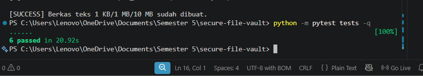
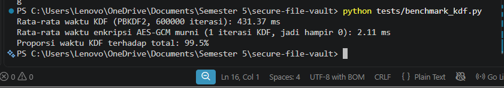
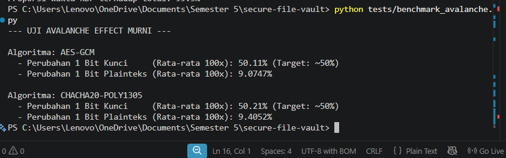
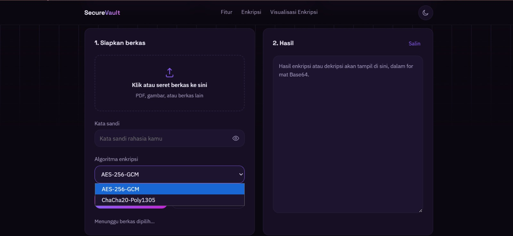
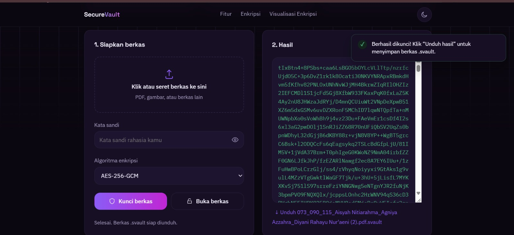
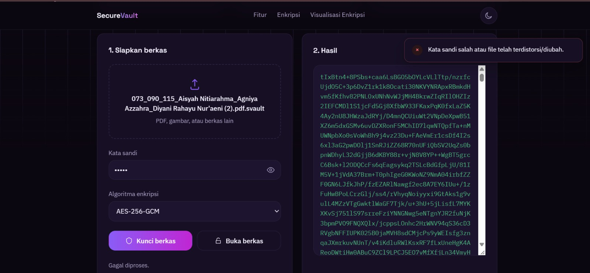
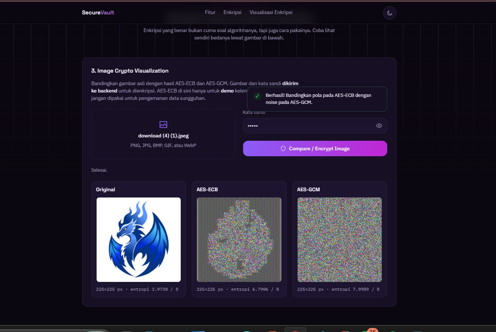

# LAPORAN IMPLEMENTASI ENKRIPSI BERKAS MODERN
# DAN VISUALISASI KOMPARATIF MODE ENKRIPSI CITRA

Laporan ini disusun untuk memenuhi salah satu tugas mata kuliah
Keamanan Informasi dengan dosen pengampu Ir. Alam Rahmatulloh,
S.T., M.T., MCE., IPM.

Semester 5 Tahun Akademik 2026/2027

================================================================

## Disusun oleh

1. Aisyah Nitiarahma        247006111073

2. Agniya Azzahra           247006111090

3. Diyani Rahayu Nur’aeni   247006111115

================================================================

Link YouTube:

Link Repo GitHub:

================================================================

PROGRAM STUDI INFORMATIKA

FAKULTAS TEKNIK

UNIVERSITAS SILIWANGI

KOTA TASIKMALAYA

2026


================================================================
# DAFTAR ISI
================================================================

- [DAFTAR GAMBAR](#daftar-gambar)
- [DAFTAR TABEL](#daftar-tabel)
- [DAFTAR LAMPIRAN](#daftar-lampiran)

- [BAB I PENDAHULUAN](#bab-i-pendahuluan)
  - [1.1. Latar belakang](#11-latar-belakang)
  - [1.2. Rumusan Masalah](#12-rumusan-masalah)
  - [1.3. Tujuan](#13-tujuan)

- [BAB II DASAR TEORI](#bab-ii-dasar-teori)
  - [2.1. AES-256-GCM](#21-aes-256-gcm-galoiscounter-mode)
  - [2.2. Penurunan Kunci dengan PBKDF2-HMAC-SHA256](#22-penurunan-kunci-dengan-pbkdf2-hmac-sha256)
  - [2.3. ChaCha20-Poly1305](#23-chacha20-poly1305-sebagai-algoritma-pembanding)
  - [2.4. Avalanche Effect](#24-avalanche-effect)
  - [2.5. Entropi Shannon](#25-entropi-shannon)

- [BAB III RANCANGAN SISTEM](#bab-iii-rancangan-sistem)
  - [3.1. Arsitektur Sistem](#31-arsitektur-sistem)
  - [3.2. Diagram Alur](#32-diagram-alurflowchart)
  - [3.3. Rancangan Antarmuka](#33-rancangan-antarmuka)

- [BAB IV IMPLEMENTASI](#bab-iv-implementasi)
  - [4.1. Modul Penurunan Kunci dan Enkripsi](#41-modul-penurunan-kunci-dan-enkripsi-backendcryptopy)
  - [4.2. Visualisasi Perbandingan Mode ECB vs GCM](#42-visualisasi-perbandingan-mode-ecb-vs-gcm)
  - [4.3. Endpoint API](#43-endpoint-api)

- [BAB V PENGUJIAN DAN ANALISIS](#bab-v-pengujian-dan-analisis)
  - [5.1. Hasil Pengujian Kinerja Enkripsi/Dekripsi](#51-hasil-pengujian-kinerja-enkripsidekripsi)
  - [5.2. Analisis Avalanche Effect](#52-analisis-avalanche-effect)
  - [5.3. Analisis Entropi dan Distribusi Byte](#53-analisis-entropi-dan-distribusi-byte-histogram)
  - [5.4. Analisis Dominasi Waktu KDF](#54-analisis-dominasi-waktu-key-derivation-function-kdf)
  - [5.5. Hasil Pengujian Kualitas Aplikasi](#55-hasil-pengujian-kualitas-aplikasi-quality-assurance)
  - [5.6. Pembahasan](#56-pembahasan)

- [BAB VI KESIMPULAN DAN SARAN](#bab-vi-kesimpulan-dan-saran)
  - [6.1. Kesimpulan](#61-kesimpulan)
  - [6.2. Saran](#62-saran)

- [DAFTAR PUSTAKA](#daftar-pustaka)
- [LAMPIRAN](#lampiran)


================================================================
# DAFTAR GAMBAR
================================================================

1. Gambar 3.1 Arsitektur Sistem Secure File Vault
2. Gambar 3.2 Diagram Alur Proses Enkripsi, Dekripsi,
   dan Visualisasi ECB vs GCM


================================================================
# DAFTAR TABEL
================================================================

1. Tabel 5.1 Hasil pengujian kinerja enkripsi dan dekripsi
2. Tabel 5.2 Hasil pengujian kualitas aplikasi (QA)


================================================================
# DAFTAR LAMPIRAN
================================================================

- Lampiran A - Bukti Unit Test Passed
- Lampiran B - Analisis Dominasi Waktu PBKDF2
- Lampiran C - Bukti Uji Avalanche Effect Murni
- Lampiran D - Tampilan Awal Secure File Vault
- Lampiran E - Ketika File Berhasil di Encrypt
- Lampiran F - Ketika File Gagal di Decrypt Karena Salah
  Password/Byte Chiperteks Diubah
- Lampiran G - Image Crypto Visualization


================================================================
# BAB I PENDAHULUAN
================================================================

## 1.1. Latar belakang

Perlindungan data sensitif merupakan kebutuhan krusial di era
digital untuk mencegah akses tidak sah dan manipulasi data.
Penggunaan mode cipher blok tanpa autentikasi seperti Electronic
Codebook (ECB) masih sering ditemui, padahal mode ini membocorkan
pola plaintext pada ciphertext karena blok identik menghasilkan
keluaran identic (Dworkin, 2007).

Untuk mengatasi kelemahan tersebut, dikembangkan Secure File
Vault, aplikasi web pengaman berkas berbasis AES-256-GCM
(Galois/Counter Mode) yang menjamin kerahasiaan sekaligus
integritas data melalui skema Authenticated Encryption with
Associated Data (AEAD) (Dworkin, 2007; R.M. Hilmy Hernandi &
Joko Christian Chandra, 2024).

Sebagai pembanding performa, aplikasi ini mengimplementasikan
algoritma AEAD berbasis stream cipher, yaitu ChaCha20-Poly1305
(Nir & Langley, 2018).

Kunci enkripsi diturunkan dari kata sandi menggunakan
PBKDF2-HMAC-SHA256 sebanyak 600.000 iterasi untuk memperkuat
ketahanan terhadap serangan brute-force (Kaliski & Rusch, 2017;
Turan et al., 2010).

Selain itu, fitur visualisasi citra BMP disediakan untuk
membuktikan kelemahan mode ECB dibanding GCM secara empiris.


## 1.2. Rumusan Masalah

1. Bagaimana mengimplementasikan enkripsi dan dekripsi berkas
   menggunakan AES-256-GCM dan ChaCha20-Poly1305 berbasis kunci
   turunan PBKDF2-HMAC-SHA256?

2. Bagaimana mekanisme authenticated encryption menolak dekripsi
   jika kata sandi salah atau ciphertext dimodifikasi?

3. Seberapa baik kinerja algoritma ditinjau dari waktu eksekusi,
   dominasi waktu KDF, avalanche effect, dan entropi ciphertext?

4. Bagaimana perbedaan tingkat keamanan mode ECB dan GCM dapat
   divisualisasikan secara nyata pada citra digital?


## 1.3. Tujuan

1. Mengimplementasikan aplikasi enkripsi/dekripsi berkas
   menggunakan AES-256-GCM dan ChaCha20-Poly1305 dengan PBKDF2
   (600.000 iterasi).

2. Menguji integritas authenticated encryption (negative test)
   terhadap kesalahan kata sandi dan manipulasi ciphertext.

3. Menganalisis secara kuantitatif waktu eksekusi, proporsi waktu
   PBKDF2, avalanche effect, dan entropi ciphertext.

4. Memvisualisasikan perbedaan keamanan mode operasi ECB dan GCM
   pada citra BMP.


================================================================
# BAB II DASAR TEORI
================================================================

## 2.1. AES-256-GCM (Galois/Counter Mode)

AES adalah cipher blok simetris 128-bit dengan kunci hingga
256-bit.

GCM menggabungkan mode Counter untuk enkripsi dengan fungsi GHASH
untuk autentikasi, menghasilkan Authenticated Encryption with
Associated Data (Dworkin, 2007):

```
Ci = Pi XOR Ek(Ji)
````

dengan:

* Ci = blok cipherteks
* EK = fungsi AES dengan kunci K
* Ji = counter block dari nonce

GCM turut menghasilkan authentication tag T yang memverifikasi
keaslian dan integritas data.

Implementasi menggunakan kunci 256-bit, nonce acak 12 byte,
dan tag 16 byte.

## 2.2. Penurunan Kunci dengan PBKDF2-HMAC-SHA256

Kunci diturunkan dari kata sandi menggunakan PBKDF2
(Kaliski & Rusch, 2017):

```
DK = PBKDF2(PRF, Password, Salt, c, dkLen)
```

Implementasi menggunakan HMAC-SHA256 sebagai PRF, salt 16 byte
acak, dkLen 32 byte (256-bit), dan iterasi (c) 600.000 —
mengikuti rekomendasi Sönmez Turan dkk. (2010) agar brute-force
kata sandi menjadi lambat secara komputasi.

## 2.3. ChaCha20-Poly1305 sebagai Algoritma Pembanding

Selain AES-256-GCM, aplikasi juga mendukung ChaCha20-Poly1305,
sebuah skema AEAD berbasis stream cipher ChaCha20 yang
dikombinasikan dengan fungsi autentikasi Poly1305
(Nir & Langley, 2018).

Berbeda dengan AES yang merupakan cipher blok dan memanfaatkan
instruksi perangkat keras khusus (AES-NI) untuk kecepatan,
ChaCha20 dirancang agar efisien dijalankan murni secara
perangkat lunak, sehingga sering digunakan sebagai alternatif
pada perangkat tanpa akselerasi AES.

Kedua algoritma sama-sama tergolong AEAD modern dan
direkomendasikan untuk menggantikan mode-mode lama yang tidak
menyediakan autentikasi, seperti AES-CBC atau AES-ECB.

## 2.4. Avalanche Effect

Mengukur perubahan cipherteks akibat perubahan 1 bit input
(Stallings, 2017):

```
Avalanche Effect (%)
=
(jumlah bit berbeda antara C1 dan C2
 / total bit cipherteks) × 100%
```

dengan C1 adalah cipherteks dari input asli dan C2 adalah
cipherteks dari input yang telah diubah satu bit.

Algoritma dikatakan memiliki difusi yang baik apabila nilai
avalanche effect mendekati 50%.

## 2.5. Entropi Shannon

Mengukur keacakan data byte (Shannon, 1948):

```
H(X) = -Σ p(xi) × log2 p(xi)
```

untuk i = 0 sampai 255.

dengan p(xi) adalah probabilitas kemunculan nilai byte xi
dalam data.

Nilai entropi berkisar antara 0 (data sepenuhnya dapat
diprediksi) hingga 8 bit (data sepenuhnya acak).

Cipherteks yang aman idealnya memiliki entropi mendekati 8,
karena menunjukkan bahwa cipherteks secara statistik tidak
dapat dibedakan dari derau acak.

================================================================

# BAB III RANCANGAN SISTEM

================================================================

## 3.1. Arsitektur Sistem

### Gambar 3.1 Arsitektur Sistem Secure File Vault

[Lihat Gambar 3.1 - Arsitektur Sistem](./arsitektur-sistem.jpeg)

Secure File Vault dibangun dengan arsitektur client-server
sederhana yang terdiri atas tiga lapisan:

### 1. Frontend

Frontend (`frontend/index.html`, `script.js`, `style.css`)
merupakan antarmuka berbasis HTML/CSS/JavaScript murni yang
berjalan di sisi klien (browser).

Frontend bertugas menerima input berkas dan kata sandi dari
pengguna, lalu mengirimkannya ke backend melalui permintaan
HTTP.

### 2. Backend API

Backend API (`backend/main.py`) dibangun menggunakan framework
FastAPI (Python).

Backend menyediakan lima endpoint REST:

* `/api/encrypt-text`
* `/api/decrypt-text`
* `/api/encrypt-file`
* `/api/decrypt-file`
* `/api/visualize-bmp`

### 3. Modul Kriptografi

Modul kriptografi (`backend/crypto.py` dan
`backend/metrics.py`) merupakan modul inti yang menangani
seluruh proses derivasi kunci, enkripsi, dekripsi, serta
perhitungan metrik pengujian.

Metrik tersebut meliputi:

* entropi
* avalanche effect
* histogram byte

Alur enkripsinya yaitu, pengguna mengunggah berkas dan kata
sandi lewat frontend, kemudian dikirim ke backend melalui
POST `/api/encrypt-file`.

Backend menjalankan PBKDF2-HMAC-SHA256 dengan 600.000 iterasi
untuk menurunkan kunci, lalu AES-256-GCM atau
ChaCha20-Poly1305 untuk menghasilkan cipherteks dan
authentication tag.

Hasil dikembalikan sebagai JSON berisi:

* algoritma
* salt
* nonce
* ciphertext
* tag

Alur dekripsi berjalan simetris. Kunci diturunkan kembali dari
salt tersimpan, lalu authentication tag diverifikasi sebelum
plainteks dikembalikan.

Apabila kata sandi salah atau cipherteks dimodifikasi,
verifikasi gagal dan backend menolak tanpa mengungkap isi data.

## 3.2. Diagram Alur (Flowchart)

### Gambar 3.2 Diagram Alur Proses Enkripsi, Dekripsi, dan Visualisasi ECB vs GCM

[Diagram Alur Proses Enkripsi, Dekripsi, dan Visualisasi ECB vs GCM](./diagram-alur.jpeg)

Gambar 3.2 menunjukkan diagram alur tiga proses utama
Secure File Vault.

Alur enkripsi berkas dimulai dari input plainteks dan kata
sandi, membangkitkan salt dan nonce acak, menurunkan kunci
melalui PBKDF2-HMAC-SHA256, lalu mengenkripsi data dan
menghasilkan authentication tag sebagai keluaran.

Alur dekripsi berjalan simetris, mengekstrak salt, nonce, dan
tag dari berkas terenkripsi, menurunkan kembali kunci, lalu
memverifikasi tag sebelum mengembalikan plainteks.

Apabila verifikasi gagal, sistem menampilkan pesan error.

Alur ketiga menunjukkan proses visualisasi perbandingan mode
ECB dan GCM pada citra BMP, memisahkan header dari data piksel
sebelum dienkripsi dengan kedua mode untuk ditampilkan
berdampingan.

## 3.3. Rancangan Antarmuka

Antarmuka pengguna dirancang dalam tiga bagian pada satu
halaman:

### 1. Siapkan Berkas

Merupakan area unggah berkas (drag-and-drop atau klik) dan
kolom kata sandi, dengan dua tombol aksi:

* "Kunci berkas" (enkripsi)
* "Buka berkas" (dekripsi)

### 2. Hasil

Menampilkan status proses (berhasil/gagal), pratinjau metadata
hasil, dan tautan unduh berkas keluaran.

### 3. Image Crypto Visualization

Merupakan bagian khusus untuk fitur pengayaan, memungkinkan
pengguna mengunggah citra BMP dan membandingkan secara langsung
hasil visual serta statistik antara mode ECB dan mode GCM.

Rancangan ini dipilih agar pengguna dapat langsung melihat
hasil dan umpan balik dari setiap aksi tanpa berpindah halaman,
sekaligus menampilkan bukti visual perbedaan keamanan mode
operasi cipher.

Dokumentasi tampilan dan penggunaan aplikasi web Secure File
Vault disajikan dalam bentuk tangkapan layar (screenshot) yang
mencakup tampilan antarmuka serta fitur-fitur utama aplikasi.

Dokumentasi tersebut dapat dilihat pada bagian Lampiran laporan
ini.

================================================================

# BAB IV IMPLEMENTASI

================================================================

## 4.1. Modul Penurunan Kunci dan Enkripsi

## (backend/crypto.py)

Fungsi `derive_key()` mengimplementasikan
PBKDF2-HMAC-SHA256 sesuai parameter pada bagian 2.2,
menghasilkan kunci 256-bit dari kata sandi dan salt.

Fungsi `encrypt_data()` menggunakan kunci tersebut untuk
mengenkripsi data dengan AES-256-GCM atau ChaCha20-Poly1305
melalui `encrypt_and_digest()`, menghasilkan cipherteks
beserta authentication tag.

Salt dan nonce dibangkitkan menggunakan `get_random_bytes()`
(CSPRNG) dari PyCryptodome, sesuai ketentuan tugas.

Saat dekripsi, `decrypt_and_verify()` memverifikasi tag terlebih
dahulu, sehingga kata sandi salah atau cipherteks yang
dimodifikasi otomatis ditolak.

Implementasi kedua fungsi ini ditunjukkan pada Gambar 4.1.

```python
def derive_key(
    password: str,
    salt: bytes,
    iterations: int = DEFAULT_ITERATIONS
) -> bytes:
    """Menurunkan kunci 256-bit dari password
    menggunakan PBKDF2-HMAC-SHA256."""
    return PBKDF2(
        password,
        salt,
        dkLen=32,
        count=iterations,
        hmac_hash_module=SHA256
    )


def encrypt_data(
    data: bytes,
```

## 4.2. Visualisasi Perbandingan Mode ECB vs GCM

Fungsi `encrypt_bmp_ecb()` mengimplementasikan mode ECB murni
sebagai pembanding edukatif, bukan fitur keamanan utama.

Fungsi ini memisahkan 54 byte header BMP dari data piksel,
lalu hanya piksel yang dienkripsi dengan AES-ECB, sehingga
pola yang "membayang" dapat diamati secara visual maupun
statistik.

```python
def encrypt_bmp_ecb(bmp_bytes: bytes, password: str) -> bytes:
    if len(bmp_bytes) < 54 or bmp_bytes[:2] != b'BM':
        raise ValueError("Data bukan berkas BMP yang valid.")

    header = bmp_bytes[:54]
    pixels = bmp_bytes[54:]

    padding_len = 16 - (len(pixels) % 16)

    if padding_len != 16:
        pixels += b"\x00" * padding_len

    salt = b"DEMO_ECB_SALT123"
    key = derive_key(password, salt, iterations=100000)

    cipher = AES.new(key, AES.MODE_ECB)
    encrypted_pixels = cipher.encrypt(pixels)

    return header + encrypted_pixels[:len(bmp_bytes) - 54]
```

## 4.3. Endpoint API

Backend FastAPI menyediakan lima endpoint:

* `POST /api/encrypt-file`
* `POST /api/decrypt-file`
* `POST /api/encrypt-text`
* `POST /api/decrypt-text`
* `POST /api/visualize-bmp`

Endpoint tersebut digunakan untuk berkas, teks, serta
perbandingan ECB-GCM.

Validasi tipe data otomatis melalui Pydantic menangkap
kesalahan format permintaan sebelum masuk ke logika
kriptografi inti.

### Endpoint Enkripsi Berkas

```python
@app.post("/api/encrypt-file")
async def api_encrypt_file(
    file: UploadFile = File(...),
    password: str = Form(...),
    algorithm: str = Form("aes-gcm")
):
    try:
        content = await file.read()

        if len(content) > MAX_FILE_SIZE:
            raise HTTPException(
                status_code=413,
                detail="Ukuran file melebihi batas 25 MB."
            )

        result = encrypt_data(
            content,
            password,
            algorithm=algorithm
        )

        result["filename"] = file.filename

        return result

    except HTTPException:
        raise

    except Exception as e:
        raise HTTPException(
            status_code=400,
            detail=str(e)
        )
```

### Endpoint Dekripsi Berkas

```python
@app.post("/api/decrypt-file")
async def api_decrypt_file(
    payload: TextDecryptRequest
):
    try:
        decrypted_bytes = decrypt_data(
            payload.model_dump(),
            payload.password
        )

        return Response(
            content=decrypted_bytes,
            media_type="application/octet-stream"
        )

    except ValueError:
        raise HTTPException(
            status_code=400,
            detail="Kata sandi salah atau file telah "
                   "terdistorsi/diubah."
        )

    except HTTPException:
        raise

    except Exception as e:
        raise HTTPException(
            status_code=400,
            detail=str(e)
        )
```

================================================================

# BAB V PENGUJIAN DAN ANALISIS

================================================================

## 5.1. Hasil Pengujian Kinerja Enkripsi/Dekripsi

Pengujian dilakukan terhadap 10 jenis berkas nyata (teks,
dokumen PDF, dan gambar BMP/JPG/PNG) dengan ukuran bervariasi
(1 KB hingga 12,3 MB), masing-masing dienkripsi dan didekripsi
menggunakan dua algoritma AEAD (AES-256-GCM dan
ChaCha20-Poly1305), menghasilkan 20 baris data pengujian.

Hasilnya dirangkum pada Tabel 5.1.

### Tabel 5.1 Hasil pengujian kinerja enkripsi dan dekripsi

| Nama Berkas     | Algoritma         | Ukuran (byte) | Waktu Enkripsi (ms) | Waktu Dekripsi (ms) | Entropi Plaintext | Entropi Ciphertext | Avalanche Effect (%) |
| --------------- | ----------------- | ------------: | ------------------: | ------------------: | ----------------: | -----------------: | -------------------: |
| File Teks 1 KB  | AES-256-GCM       |         1,024 |              571.32 |              541.14 |              4.88 |               7.82 |                49.87 |
| File Teks 1 KB  | ChaCha20-Poly1305 |         1,024 |              478.48 |              475.73 |              4.88 |               7.82 |                49.19 |
| File Teks 1 MB  | AES-256-GCM       |     1,048,576 |              474.74 |              472.76 |              4.88 |               8.00 |                50.01 |
| File Teks 1 MB  | ChaCha20-Poly1305 |     1,048,576 |              495.58 |              501.53 |              4.88 |               8.00 |                50.01 |
| File Teks 10 MB | AES-256-GCM       |    10,485,760 |              551.38 |              622.01 |              4.88 |                  8 |                   50 |
| File Teks 10 MB | ChaCha20-Poly1305 |    10,485,760 |              568.47 |              598.50 |              4.88 |                  8 |                   50 |
| Dokumen PDF 1   | AES-256-GCM       |    12,303,288 |              540.65 |              521.76 |              7.99 |                  8 |                   50 |
| Dokumen PDF 1   | ChaCha20-Poly1305 |    12,303,288 |              604.71 |              579.44 |              7.99 |                  8 |                   50 |
| Dokumen PDF 2   | AES-256-GCM       |       212,155 |              465.65 |              468.07 |              7.97 |               8.00 |                49.99 |
| Dokumen PDF 2   | ChaCha20-Poly1305 |       212,155 |              461.89 |              466.37 |              7.97 |               8.00 |                50.03 |
| Gambar BMP      | AES-256-GCM       |     6,635,574 |              509.86 |              495.93 |              6.64 |                  8 |                   50 |
| Gambar BMP      | ChaCha20-Poly1305 |     6,635,574 |              622.73 |              591.90 |              6.64 |                  8 |                50.01 |
| Gambar JPG 1    | AES-256-GCM       |       107,357 |              516.34 |              477.57 |              7.53 |               8.00 |                49.99 |
| Gambar JPG 1    | ChaCha20-Poly1305 |       107,357 |              495.19 |              485.70 |              7.53 |               8.00 |                50.02 |
| Gambar JPG 2    | AES-256-GCM       |       140,531 |              493.80 |              497.81 |              7.98 |               8.00 |                50.03 |
| Gambar JPG 2    | ChaCha20-Poly1305 |       140,531 |              483.26 |              601.57 |              7.98 |               8.00 |                49.98 |
| Gambar PNG 1    | AES-256-GCM       |     1,400,325 |              472.75 |              479.49 |              7.99 |               8.00 |                50.01 |
| Gambar PNG 1    | ChaCha20-Poly1305 |     1,400,325 |              497.82 |              499.53 |              7.99 |               8.00 |                50.01 |
| Gambar PNG 2    | AES-256-GCM       |        83,400 |              464.88 |              479.18 |              7.96 |               8.00 |                   50 |
| Gambar PNG 2    | ChaCha20-Poly1305 |        83,400 |              485.29 |              467.25 |              7.96 |               8.00 |                49.99 |

Data lengkap tersedia pada `hasil_pengujian_kriptografi.xlsx`.

Waktu eksekusi relatif konstan (480-680 ms) terlepas ukuran
berkas, mengindikasikan dominasi proses derivasi kunci
dibanding enkripsi AES itu sendiri (dibahas pada 5.4).

## 5.2. Analisis Avalanche Effect

Pengujian khusus (`tests/benchmark_avalanche.py`, rata-rata
100 percobaan) mengukur avalanche effect terpisah untuk
perubahan kunci dan plainteks.

Perubahan 1 bit kunci menghasilkan avalanche effect 50,11%
(AES-GCM) dan 50,21% (ChaCha20-Poly1305) yang mendekati ideal
50%, sesuai teori difusi (Stallings, 2017).

Sebaliknya, perubahan 1 bit plainteks hanya menghasilkan
sekitar 9,07% dan 9,41%.

Ini bukan kelemahan, melainkan karakteristik mode GCM yang
berbasis Counter (CTR): setiap bit plainteks di-XOR langsung
dengan bit keystream pada posisi yang sama (rumus 2.1),
sehingga perubahan tidak menyebar ke bit lain.

Nilai 9% yang teramati sebagian besar berasal dari
authentication tag yang sensitif terhadap perubahan sekecil
apa pun (Dworkin, 2007).

## 5.3. Analisis Entropi dan Distribusi Byte (Histogram)

Entropi cipherteks meningkat signifikan dibanding plainteks
pada seluruh berkas uji (Shannon, 1948).

Kenaikan paling mencolok terlihat pada berkas teks: entropi
plainteks File Teks 1 KB hanya 4,8781 (karena redundansi alami
bahasa manusia), namun setelah dienkripsi naik menjadi 7,8180,
kenaikan hampir 3 bit penuh.

Sebaliknya, pada berkas yang formatnya sudah terkompresi
(JPG, PNG, PDF), entropi plainteks sudah tinggi sejak awal
(berkisar 7,53–7,99) karena kompresi sudah menghilangkan
sebagian besar redundansi data, sehingga kenaikan setelah
enkripsi terlihat lebih kecil meski cipherteksnya tetap
mencapai nilai mendekati 8,0.

Pengujian tambahan pada citra BMP dengan AES-ECB dan AES-GCM
(`histogram_ecb_vs_gcm.png`) memperkuat temuan ini secara
visual: plainteks asli didominasi dua nilai byte ekstrem,
AES-ECB masih menunjukkan puncak-puncak tajam (lebih dari
10.000 kemunculan) karena blok identik menghasilkan cipherteks
identik, sementara AES-GCM menghasilkan distribusi rata di
seluruh 0-255 tanpa puncak mencolok.

Temuan ini menjadi bukti empiris mengapa mode ECB tidak
direkomendasikan (Dworkin, 2007)d.

## 5.4. Analisis Dominasi Waktu Key Derivation Function (KDF)

Benchmark terpisah (`tests/benchmark_kdf.py`, 5 kali pengujian,
data 1 KB) menunjukkan waktu rata-rata derivasi kunci
(PBKDF2, 600.000 iterasi) adalah 431,37 ms, sedangkan enkripsi
AES-GCM murni hanya 2,11 ms, proporsi KDF mencapai 99,5% dari
total waktu.

Ini menjelaskan mengapa waktu enkripsi pada Tabel 5.1 relatif
konstan meski ukuran berkas bervariasi 1.000 kali lipat,
karena hanya PBKDF2 (bukan ukuran data) yang mendominasi waktu
eksekusi — trade-off keamanan yang disengaja untuk memperlambat
brute-force (Turan et al., 2010).

## 5.5. Hasil Pengujian Kualitas Aplikasi (Quality Assurance)

Pengujian fungsional pada tujuh jenis berkas (round-trip) serta
dua negative test (kata sandi salah, cipherteks dimodifikasi)
dirangkum pada Tabel 5.2.

### Tabel 5.2 Hasil pengujian kualitas aplikasi (QA)

| No | Jenis Pengujian                         | Hasil                                |
| -: | --------------------------------------- | ------------------------------------ |
|  1 | sample.pdf (round-trip)                 | Berhasil, identik dengan berkas asli |
|  2 | sample.bmp (round-trip)                 | Berhasil, identik dengan berkas asli |
|  3 | sample.jpg (round-trip)                 | Berhasil, identik dengan berkas asli |
|  4 | sample.png (round-trip)                 | Berhasil, identik dengan berkas asli |
|  5 | sample_1kb.txt (round-trip)             | Berhasil, identik dengan berkas asli |
|  6 | sample_1mb.txt (round-trip)             | Berhasil, identik dengan berkas asli |
|  7 | sample_10mb.txt (round-trip)            | Berhasil, identik dengan berkas asli |
|  8 | Dekripsi dengan kata sandi salah        | Ditolak, sesuai ekspektasi           |
|  9 | Dekripsi dengan cipherteks dimodifikasi | Ditolak, sesuai ekspektasi           |

Seluruh berkas berhasil dienkripsi dan didekripsi identik
dengan aslinya.

Kedua negative test berhasil ditolak sesuai ekspektasi,
membuktikan mekanisme authenticated encryption pada GCM
berfungsi sebagaimana mestinya (Dworkin, 2007).

## 5.6. Pembahasan

Hasil pengujian menjawab seluruh rumusan masalah pada bagian
1.2: aplikasi berhasil mengimplementasikan AES-256-GCM dengan
kinerja yang baik (avalanche ~50% untuk kunci, entropi
mendekati 8,0), mekanisme integritas data terbukti berfungsi
lewat dua negative test, dan visualisasi ECB vs GCM secara nyata
menunjukkan mengapa ECB tidak layak dipakai untuk keamanan data.

Dominasi waktu PBKDF2 (99,5%) menegaskan bahwa performa yang
relatif lambat bukan kelemahan, melainkan trade-off keamanan
yang disengaja terhadap serangan brute-force.

================================================================

# BAB VI KESIMPULAN DAN SARAN

================================================================

## 6.1. Kesimpulan

Berdasarkan implementasi dan pengujian yang telah dilakukan,
dapat disimpulkan bahwa:

1. Aplikasi Secure File Vault berhasil diimplementasikan
   menggunakan algoritma AES-256-GCM dengan kunci yang
   diturunkan dari kata sandi pengguna melalui
   PBKDF2-HMAC-SHA256 (600.000 iterasi), serta mendukung
   ChaCha20-Poly1305 sebagai algoritma pembanding.

2. Mekanisme authenticated encryption pada GCM terbukti efektif
   menolak proses dekripsi baik ketika kata sandi salah maupun
   ketika cipherteks telah dimodifikasi, sebagaimana dibuktikan
   pada pengujian negatif (bagian 5.5).

3. Kinerja algoritma menunjukkan hasil yang baik: avalanche
   effect akibat perubahan kunci mendekati ideal (~50%),
   sementara perubahan plainteks menghasilkan avalanche effect
   lebih rendah (~9%) sesuai karakteristik mode CTR-based.

   Entropi cipherteks mencapai hingga 8,0 bit per byte pada
   berkas besar.

   Waktu eksekusi total didominasi oleh proses PBKDF2
   (sekitar 99,5%), bukan oleh algoritma enkripsi itu sendiri.

4. Visualisasi perbandingan mode ECB dan GCM pada citra BMP
   secara nyata menunjukkan kelemahan mode ECB, pola pada citra
   asli masih dapat dikenali pada hasil enkripsinya, sementara
   mode GCM menghasilkan distribusi byte yang seragam dan tidak
   membocorkan informasi apa pun tentang data asli.

## 6.2. Saran

Beberapa hal yang dapat dikembangkan lebih lanjut pada proyek
serupa di masa mendatang:

1. Implementasi skema enkripsi hibrida (kunci sesi AES dibungkus
   RSA-OAEP atau disepakati melalui ECDH) untuk mendukung
   skenario berbagi berkas antar-pengguna tanpa perlu bertukar
   kata sandi secara langsung.

2. Penambahan mekanisme autentikasi API menggunakan JWT
   mengikuti pendekatan (Rahmatulloh et al., 2018), sehingga
   endpoint backend tidak dapat diakses sembarang pihak.

3. Pengujian pada jumlah iterasi PBKDF2 yang bervariasi
   (dibandingkan dengan Argon2id) untuk mengevaluasi trade-off
   antara waktu komputasi dan ketahanan terhadap serangan
   brute-force secara lebih menyeluruh.

================================================================

## DAFTAR PUSTAKA

Dworkin, M. J. (2007). *Recommendation for block cipher modes of operation: 
Galois/Counter Mode (GCM) and GMAC (NIST Special Publication 800-38D).* 
National Institute of Standards and Technology. https://doi.org/10.6028/NIST.SP.800-38D

Hernandi, R. M. H., & Chandra, J. C. (2024). Implementasi algoritme AES-256 
dan AES-GCM untuk mengamankan dokumen pada sistem data rekam medis Klinik Mulya. 
*KRESNA: Jurnal Riset dan Pengabdian Masyarakat, 
4*(1), 12–22. https://jurnaldrpm.budiluhur.ac.id/index.php/Kresna/article/view/131

Moriarty, K., Kaliski, B., & Rusch, A. (2017). *PKCS #5: 
Password-based cryptography specification version 2.1 (RFC 8018).* 
Internet Engineering Task Force. https://doi.org/10.17487/RFC8018

Nir, Y., & Langley, A. (2018). *ChaCha20 and Poly1305 for IETF protocols 
(RFC 8439).* Internet Engineering Task Force. https://doi.org/10.17487/RFC8439

Rahman, A. U., Miah, S. U., & Azad, S. (2014). Advanced encryption standard. 
In S. Azad & A.-S. K. Pathan (Eds.), *Practical cryptography: Algorithms 
and implementations using C++* (pp. 89–104). CRC Press.

Rahmatulloh, A., Sulastri, H., & Nugroho, R. (2018). Keamanan RESTful web service 
menggunakan JSON Web Token (JWT) HMAC SHA-512. *Jurnal Nasional Teknik Elektro 
dan Teknologi Informasi, 7*(2), 172–178. https://doi.org/10.22146/jnteti.v7i2.417

Shannon, C. E. (1948). A mathematical theory of communication. *Bell System 
Technical Journal, 27*(3), 379–423. https://doi.org/10.1002/j.1538-7305.1948.tb01338.x

Stallings, W. (2017). *Cryptography and network security: Principles 
and practice* (7th ed.). Pearson Education.

Sönmez Turan, M., Barker, E., Burr, W., & Chen, L. (2010). *Recommendation 
for password-based key derivation, part 1: Storage applications (NIST Special Publication 800-132).* 
National Institute of Standards and Technology. https://doi.org/10.6028/NIST.SP.800-132

Zulian, A. P., Kartarina, & Dharma, I. M. Y. (2025). Analisis pengamanan file menggunakan 
enkripsi dan dekripsi dengan algoritma AES-GCM-SIV. *Edu Elektrika Journal, 13*(1), 
15–23. https://doi.org/10.15294/eduel.v13i1.26826

# LAMPIRAN

================================================================

## Lampiran A - Bukti Unit Test Passed



================================================================

## Lampiran B - Analisis Dominasi Waktu PBKDF2



================================================================

## Lampiran C - Bukti Uji Avalanche Effect Murni



================================================================

## Lampiran D - Tampilan Awal Secure File Vault



================================================================

## Lampiran E - Ketika File Berhasil di Encrypt



================================================================

## Lampiran F - Ketika File Gagal di Decrypt Karena Salah

## Password/Byte Chiperteks Diubah



================================================================

## Lampiran G - Image Crypto Visualization



================================================================
